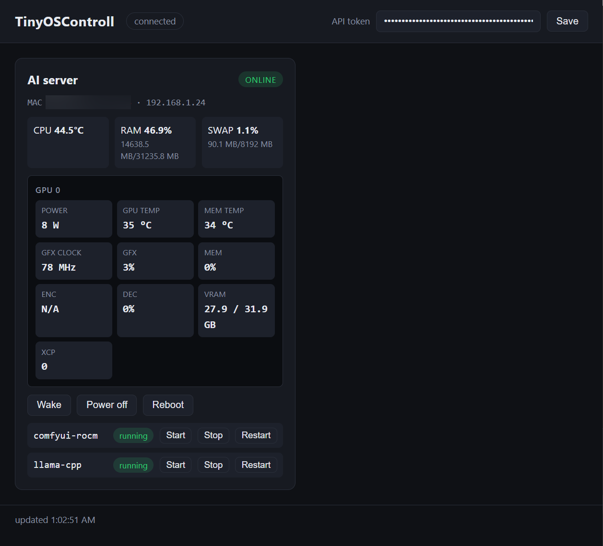

# TinyOSControll

**Languages:** [English](README.md) | [Українська](README.uk.md)

A network server management tool: a web panel on the central machine
(**main**) controls several remote servers (**agent**) — Wake-on-LAN,
shutdown, reboot, management of pre-defined Docker containers and live
telemetry (CPU / RAM / SWAP / GPU).

All code is **Python** and **bash**. No SSH, no arbitrary command execution.
Details in [`docs/SPEC.md`](docs/SPEC.md) and [`docs/PLAN.md`](docs/PLAN.md).



## Architecture

- **main** — container: web interface (HTTPS) + mTLS-WS server that talks to
  the agents + sends WoL.
- **agent** — container (several on different servers): one daemon + a
  bash dispatcher of system commands. Initiates the outbound mTLS connection
  to main.

The connection is an **mTLS-WebSocket** (shared self-signed certificate),
TLS ≥ 1.2. The agent opens no inbound ports.

## Installation

### 0. Certificate generation (once, on main)

```bash
tools/gen-certs.sh ./certs <MAIN_HOST>
# for example:
tools/gen-certs.sh ./certs 192.168.1.20
```

Creates `certs/cert.key` + `certs/cert.crt`.

### 1. Main

```bash
# copy deploy/main/docker-compose.yml and .env.example into the working directory
cp deploy/main/docker-compose.yml .
cp deploy/main/.env.example .env
# edit .env: API_TOKEN, AGENT_TOKEN, AGENT_* and BUILD_CONTEXT —
# the path to the repository root (the directory with main/, common/ and
# requirements.txt); an absolute path is safest, e.g. /home/user/oscontroll
# tokens can be any random string, e.g.: openssl rand -hex 32
docker compose up -d
# web panel: https://<main-host>:8443  (token — API_TOKEN)
```

### 2. Agent (each server)

```bash
cp deploy/agent/docker-compose.yml .
cp deploy/agent/.env.example .env
# copy the certificates from main:
mkdir -p certs && cp <main>/certs/cert.crt <main>/certs/cert.key certs/
# edit .env: MAIN_HOST, AGENT_NAME, AGENT_TOKEN, CONTAINERS, DOCKER_SOCK and
# BUILD_CONTEXT (path to the repository root, see above)
docker compose up -d
```

Note: `hostcmd.sh` (the fixed dispatcher for host commands) is copied into the
image at build time (`agent/Dockerfile` → `/opt/tinyos/hostcmd.sh`). Nothing
has to be installed on the host — `HOSTCMD` in `docker-compose.yml` is a path
inside the container.

The host must run systemd: the compose mounts `/run/systemd/private` and the
`/run/systemd/system` marker so `systemctl` inside the container drives host
PID 1 directly (poweroff / reboot). If `systemctl` cannot reach the host
systemd (e.g. under Snap Docker, where the `/run/systemd/private` bind mount
is not the host's live socket), `hostcmd.sh` falls back to the `reboot(2)`
syscall, which needs `CAP_SYS_BOOT` (already added in the compose).

**Troubleshooting poweroff/reboot:** `docker logs tinyos-agent` shows the
startup diagnostics (env vars, `/run/systemd` contents, a `systemctl`
self-test, and whether `CAP_SYS_BOOT` is present) and every request with its
result; `./logs/hostcmd.log` on the host contains the exact exit code and
output of both the `systemctl` attempt and the `reboot(2)` fallback. A
`reboot(2) failed: errno=1` (EPERM) means `CAP_SYS_BOOT` is missing. After
changing anything under `agent/`, rebuild: `docker compose up -d --build`.

You can also simply clone the repository onto both machines and run
`docker compose up -d` from `<repo>/deploy/main` (or `<repo>/deploy/agent`) —
the default `BUILD_CONTEXT=../..` then resolves to the repository root.

### Snap Docker

Snap Docker isolates the network and changes the socket path:

- In the agent `.env`: `DOCKER_SOCK=/var/snap/docker/current/docker.sock`.
- For WoL: `NETWORK_MODE=host` (Snap Docker supports the host network). If the
  broadcast does not reach the LAN, check the snap network settings.
- Poweroff/reboot: the `/run/systemd/private` bind mount is not the host's
  live socket under Snap Docker, so `systemctl` fails and `hostcmd.sh` uses
  the `reboot(2)` fallback (`CAP_SYS_BOOT`, already in the compose). This is a
  hard power-off/reboot (no systemd service shutdown).

### AMD GPU telemetry (optional)

`hostcmd.sh` runs inside the container, so GPU telemetry needs `amd-smi` and
the GPU devices made available there. On an AMD GPU host:

1. Install `amd-smi` on the host (e.g. Ubuntu 24.04+: `sudo apt install amd-smi`).
2. Start the agent with the GPU override:
   ```
   docker compose -f docker-compose.yml -f docker-compose.gpu.yml up -d
   ```
   The override mounts the host's `amd-smi` binary and `/dev/kfd` +
   `/dev/dri` into the container.
3. Do **not** use the override on hosts without an AMD GPU — the container
   will fail to start because `/dev/kfd` does not exist.

`hostcmd.sh` finds `amd-smi` via the `AMDSMI` env var, the mounted
`/opt/tinyos/amd-smi`, or the container PATH; `docker logs tinyos-agent`
shows which one it uses at startup. Without `amd-smi` the `amd_smi` field is
simply empty (not an error).

## Features

- **Wake-on-LAN** by MAC (sent by main).
- **Shutdown** / **reboot** of the server.
- **Containers**: status, start / stop / restart (allow-list in the agent `.env`).
- **Telemetry** (once per second): `amd-smi monitor`, CPU temperatures,
  RAM, SWAP, load, uptime.

## Home Assistant

A custom integration (`custom_components/oscontroll/`) plus a ready-made
Lovelace dashboard bring agents, telemetry, GPU metrics and controls into
Home Assistant.

Installation, configuration and dashboard setup:
[docs/HOME_ASSISTANT.md](docs/HOME_ASSISTANT.md).

## Local testing (without real servers)

```bash
python3 -m venv .venv
.venv/bin/pip install -r requirements-dev.txt
.venv/bin/python -m pytest tests/ -q
```

See `docs/PLAN.md` section 3.2 for the local integration scenario.

## Structure

```
common/    # protocol, tls, wol (shared code)
agent/     # agent.py, hostcmd.sh, entrypoint.sh, Dockerfile
main/      # main.py, web/, Dockerfile
deploy/    # docker-compose.yml + .env.example for main, agent, HA dashboard
tools/     # gen-certs.sh
tests/     # unit + local integration
docs/      # SPEC.md, PLAN.md, HOME_ASSISTANT.md/.uk.md, images/
custom_components/  # Home Assistant integration (oscontroll)
```
